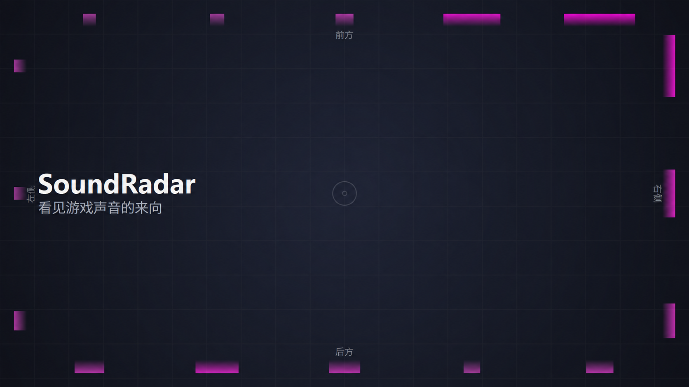

# SoundRadar 中文版



SoundRadar 会把游戏中的环绕声转换成屏幕边缘的方向雷达，让你通过视觉判断声音来自哪里。它适用于听力受限、单耳听力或希望更直观辨别游戏声音方向的玩家。

屏幕上边代表前方，下边代表后方，左右两边对应左右方向。声音越响，雷达亮块越大、越亮。

 

## 功能

- **真实环绕声雷达**：接收 7.1 声道音频时显示前、后、左、右方向；立体声模式显示左右方向。
- **保留游戏声音**：环绕声模式会把所有采集声道混成单声道并播放到耳机，让单耳听力玩家也能听到各声道的声音，包括语音。
- **点击穿透浮层**：操作会直接传给游戏，可显示在无边框窗口游戏上方；不会向游戏注入代码。
- **托盘菜单和设置面板**：从系统托盘暂停、恢复或退出。可实时调整灵敏度、声音强弱对比、雷达大小和亮度、消退速度、格数、厚度、不透明度、颜色、耳机音量、弱声增强和显示器；设置自动保存。
- **实时音频检测**：检测页显示每个采集声道的音量，并提示是否检测到方向、是否只有立体声或没有收到声音。
- **音频样本录制**：可录制采集到的游戏声音，以便检查和调节雷达识别效果。

## 模式

| 模式 | 声道 | 方向 | 音频设置 |
| --- | --- | --- | --- |
| 环绕声 | 完整 7.1（8 声道） | 前、后、左、右 | 需要虚拟 7.1 声道设备，详见 [7.1 设置指南](SETUP.md) |
| 立体声 | 2 声道 | 左、右 | 无需更改音频设备 |

使用立体声模式可立即试用：

```sh
pip install -r requirements.txt
python run.py --all-apps
```

设置完整 7.1 模式前，请先按 [SETUP.md](SETUP.md) 配好 VoiceMeeter 和游戏输出，再从托盘菜单打开“设置”，选择“环绕声”模式、采集设备和耳机播放设备。保存后重启 SoundRadar。

运行游戏时请使用“无边框窗口”模式。SoundRadar 启动后会缩到系统托盘；右键托盘图标可打开“设置”、暂停雷达或退出。也可以运行 `SoundRadar.bat`。

## 工作方式

- 通过 WASAPI 回环采集 Windows 音频。立体声模式可采集系统应用声音；环绕声模式从虚拟 7.1 设备逐声道采集。
- 分析每个声道的音量和频段，抑制环境底噪，并平滑显示声音方向。
- 使用 PySide6 绘制透明、置顶、点击穿透的屏幕浮层。

## 许可证和上游项目

本仓库基于 [xxsniperGD/SoundRadar](https://github.com/xxsniperGD/SoundRadar)，保留原项目的 MIT 许可证。SoundRadar 使用 PySide6（LGPL）、soundcard、numpy 和 comtypes。
